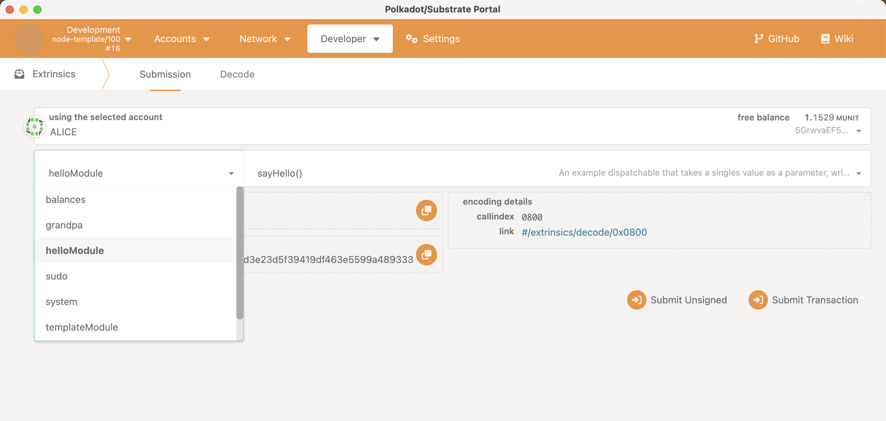

# Template Pallet

## Overview

<!-- TODO: Write descriptions for the pallet -->

## Build

Check if the dependencies are working properly:

```console
$ cargo check -p node-template-runtime
```

Build the runtime's WASM binary with the following command:

```console
$ cargo build --release
```

## Test

<!-- TODO: -->

## Mock

<!-- TODO: -->

## Benchmark

<!-- TODO: -->

## Demo

Run a relaychain node (w/o debug mode):

```console
$ ./target/release/node-template --dev
```

In debug mode, run a relaychain node:

```console
$ RUST_LOG=runtime=debug ./target/release/node-template --dev
```

---

In `substrate-front-end-template` repo GUI, open the app in browser:

```console
$ npm run start
```

---

Go to "Developer >> Extensions" page in Polkadot JS Apps:

<!-- 
 -->

---

View the pallet in polkadot js apps:

<!-- 
 -->

---

view the pallet dispatchables in polkadot js apps:

<!-- 
 -->

---

## Pallet

### Dispatchables
